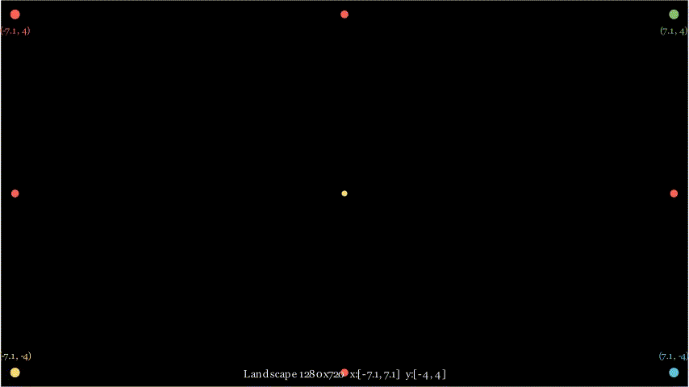
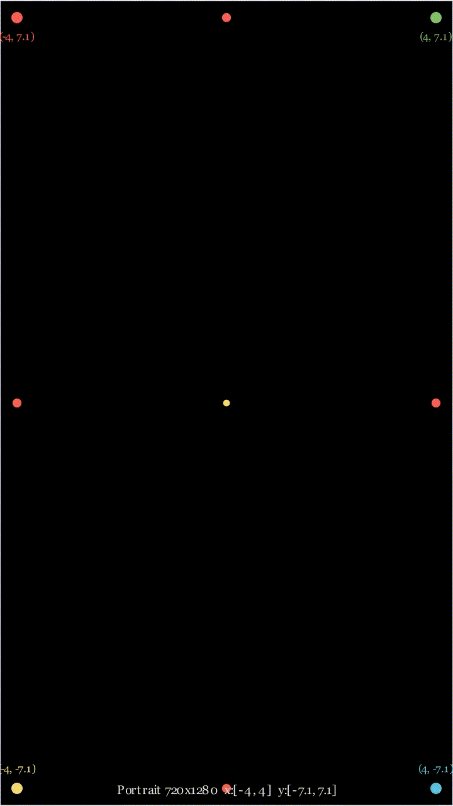

# manim-web 快速上手

> 5 分钟从安装到第一个动画

---

## 一、环境要求

| 项目 | 要求 |
|------|------|
| 操作系统 | Windows 10/11 64位 |
| Python | 3.12 |
| 内存 | ≥ 8GB |
| ffmpeg | 视频导出必需 |
| LaTeX | 可选，数学公式需要 |

### 安装 Python 依赖

```bash
cd manim-web
pip install -e .
```

### 安装 ffmpeg

```bash
winget install ffmpeg
# 或从 https://ffmpeg.org/download.html 下载
```

---

## 二、启动 MCP 服务

```bash
python -m manim_web
```

服务以 stdio 模式启动，AI 工具（Claude、GPT、Qwen 等）通过 MCP 协议连接。

---

## 三、核心概念

### 项目 (Project)

每个项目是一个**独立的 manim 场景**，拥有：
- 浏览器实时预览窗口
- 终端渲染日志
- 工作区目录（scene.py、state.json、preview.png、port.info、render.log）
- 累积代码历史

项目之间完全隔离。

### 操作类型

| 操作 | 说明 | 浏览器效果 |
|------|------|-----------|
| `add_mobject` | 静态添加图形 | 瞬间出现 |
| `play` | 播放动画 | 按帧渲染 |
| `add` | 执行任意代码 | 取决于代码 |

### 沙箱级别

| 级别 | 说明 |
|------|------|
| `strict` | 默认，仅 manim API + 数学工具 |
| `relaxed` | 允许项目目录文件读取 + 白名单 import |
| `full` | 无限制，AI 生成代码完全信任 |

---

## 四、5 分钟入门

### 步骤 1：初始化项目

```
web_persistent_start(project="my-first")
```

返回浏览器预览 URL 和工作区路径。

### 步骤 2：创建图形

```
web_persistent_mobject(class_name="Circle", name="c", kwargs={"radius": 1, "color": "RED"})
```

圆形瞬间出现在浏览器中。

### 步骤 3：播放动画

```
web_persistent_play(anim_class="Create", targets="c", run_time=1)
```

圆形以描边动画出现在浏览器中。

### 步骤 4：变换图形

```
web_persistent_mobject(class_name="Square", name="s", kwargs={"side_length": 1, "color": "BLUE"})
web_persistent_play(anim_class="Transform", targets="c,s")
```

圆形变换为正方形。

### 步骤 5：导出视频

```
web_persistent_render_video(format="mp4", quality="high")
```

生成完整质量的 .mp4 文件。

---

## 五、常用动画类

| 类名 | 效果 |
|------|------|
| `Create` | 描边出现 |
| `FadeIn` / `FadeOut` | 淡入 / 淡出 |
| `Write` | 书写文字 |
| `GrowFromCenter` | 从中心生长 |
| `Transform` | 变换（保留源） |
| `ReplacementTransform` | 变换（替换源） |
| `MoveToTarget` | 移动到目标位置 |
| `Indicate` | 指示闪烁 |
| `Circumscribe` | 圈选 |

---

## 六、常用图形类

| 类名 | 关键参数 |
|------|---------|
| `Circle` | `radius`, `color` |
| `Square` | `side_length`, `color` |
| `Rectangle` | `width`, `height`, `color` |
| `Triangle` | `color` |
| `Line` | `start`, `end`, `color` |
| `Arrow` | `start`, `end`, `color` |
| `Dot` | `point`, `color` |
| `Text` | `text`, `font_size` |
| `MathTex` | `tex_string` |
| `Axes` | `x_range`, `y_range` |
| `NumberLine` | `x_range` |

---

## 七、画面方向与坐标体系

### 7.1 横版（landscape）与竖版（portrait）

创建项目时通过 `orientation` 参数指定画面方向：

```
web_persistent_start(project="my-video", orientation="landscape")  # 横版 1280x720
web_persistent_start(project="my-video", orientation="portrait")   # 竖版 720x1280
```

### 7.2 坐标范围

两种方向的坐标体系不同，布局时需注意：

| 方向 | 像素分辨率 | frame_width | frame_height | x 范围 | y 范围 |
|------|-----------|-------------|-------------|--------|--------|
| **横版** landscape | 1280×720 | 14.2 | 8.0 | [-7.1, 7.1] | [-4, 4] |
| **竖版** portrait | 720×1280 | 8.0 | 14.2 | [-4, 4] | [-7.1, 7.1] |

> 竖版时 frame_width 和 frame_height 互换，x 方向变窄、y 方向变长。

### 7.3 布局建议

- **横版**：图形横向排列（`arrange(RIGHT)`），公式水平展示
- **竖版**：图形纵向排列（`arrange(DOWN)`），公式垂直展示，充分利用 y 方向空间

### 7.4 模板文件

`docs/templates/` 目录提供横版和竖版演示模板，包含边界标记、坐标标注、几何图形、公式、贴近边缘移动等示例：

| 文件 | 方向 | 渲染命令 |
|------|------|----------|
| `landscape_demo.py` | 横版 1280×720 | `manim -ql --format gif landscape_demo.py LandscapeDemo` |
| `portrait_demo.py` | 竖版 720×1280 | `manim -ql --format gif portrait_demo.py PortraitDemo` |
| `edge_boundary_demo.py` | 横版边界测试 | `manim -ql --format gif edge_boundary_demo.py EdgeBoundaryDemo` |

> **注意**：竖版模板在 Python 文件中通过 `config` 设置分辨率（manim CLI 的 `-r` 参数仅支持 16:9 横版），无需额外命令行参数。

预览效果：

- 横版：
- 竖版：

---

## 八、下一步

- 完整工具参考 → [工具手册.md](工具手册.md)
- 架构与原理 → [架构设计.md](架构设计.md)
- 问题排查 → [常见问题.md](常见问题.md)